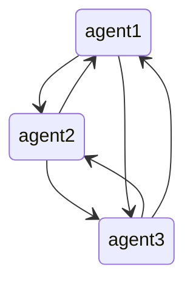

# DeNeg Library

Library for decentralized negotiation system. (Toy Example)

**Prototype**

DeNeg is a python library for user to implement decentralized negotiation system on each agent. This library provide simple APIs with abstract and member functions for user to participant in a decentralized negotiation system.



Dependencies
 - ros2 (Tested on humble)

Compilation
```bash
cd ros2_ws
colcon build
```

## Example

```bash
source install/setup.bash
cd deneg/deneg_core/scripts
# run example with task allocation
python3 agent.py --task_alloc --multi

# Path resolution example
python3 agent.py --path_res --multi
```

## Code Snippet

Simple example of using DeNeg for task allocation 

```py
class Agent(DeNeg):
    def __init__(self, name):
        super().__init__(name)
    
    # to whether join the room
    def receive_alert(self, req):
        print(f" {self.name} received alert with id {req.id}")
        return True

    def proposal_submission(req, round):
        cost = my_cost_calculation(req.nego_content)
        return {self.name: {"cost": cost}}

    def round_table(req, round, other_proposals):
        # Return ranking, always assume our proposal is the best
        return [self.name]

    def concession(req, round, result):
        # always accept all proposals
        return True

    def assignment(self, req, proposal):
        # accept then execute the assignment

agent = Agent(agent_name)
agent.spin()

# ....
# Agent X can send in an alert with fn call
a.submit("req0", {})

# or submit a path conflict
a.submit("req2", {'desc': "path conflict"}, Type.PATH_RESOLUTION)

# or submit a task allocation req
a.submit("req1", {'desc': "fetch me!"}, Type.TASK_ALLOCATION)
```

## Multi process example

Run these command in three terminals (3 seperate processes) and observe!

```bash
# terminal 1
python3 agent.py --spin -a agent1

# terminal 2
python3 agent.py --spin -a agent2

# terminal 3: submit task/path_conflict
python3 agent.py --task_alloc -a agent3
# or
python3 agent.py --path_res -a agent3
```

## Potential Improvements

 - Use [fcl](https://github.com/BerkeleyAutomation/python-fcl/) For path conflict detection
 - Fault tolerance and better state synchronization
 - task swapping? return of evaluation heuristic for better replanning of conflict task
 - more robust `nego_queue` task queue handling.
